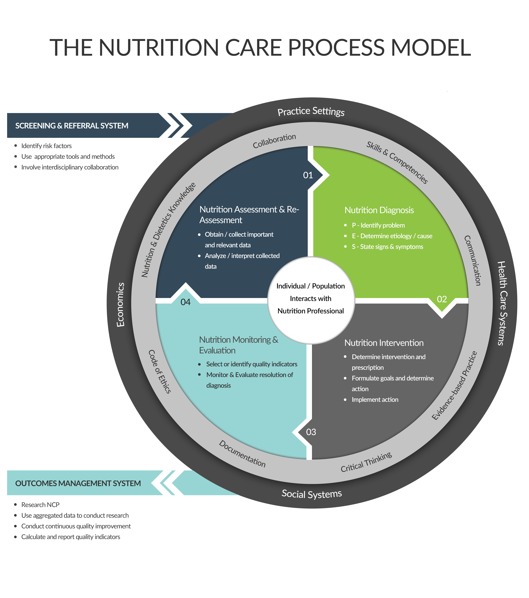

# What is NCP and NCPT?

Effective nutrition and dietetics care delivery hinges on a structured approach that ensures consistency, quality, and personalized care. This chapter introduces the **Nutrition Care Process (NCP) Model** and its associated **Nutrition Care Process Terminology (NCPT)** , a pivotal framework and standardized language designed to help professionals deliver tailored nutrition and dietetics care. The NCP Model and NCPT have been developed and continually refined over years through global collaboration, led by the **Academy of Nutrition and Dietetics**(referred to as the Academy thereafter), with input from numerous dietetic associations around the world.

Additionally, the chapter will introduce the **SNOMED CT\*\*\*\*NCPT Reference Set (or refset)** , which further enhances the ability of healthcare professionals to standardize and integrate nutrition and dietetics care into broader clinical systems, supporting interoperability and comprehensive patient care across settings.

At present, the SNOMED CT NCPT Reference Set (release of April 2025) contains the "problems" or nutrition diagnoses. and "intervention" terms of the NCPT (edition 2020). The plan is to add next the nutrition assessment, monitoring and evaluation terms of NCPT (April 2026 as resources and capacity permit). It is important to emphasize that SNOMED CT is used by many countries where English is not the main language. The Nutrition and Dietetics CRG which has a wide international membership encourages the translation of the SNOMED CT NCPT refset and welcomes updates on translation efforts. Sweden already has a SNOMED CT NCPT refset release containing the diagnostic terms in the Swedish language since November 2024. For more on the translation process of refsets, please see section [Translating Reference Set Members](<../6 technical-application/6.2-translating-reference-set-members.md>) of this guide.

## Nutrition Care Process Model (NCPM)

The Nutrition Care Process Model (NCPM) serves as a framework for healthcare professionals engaged in providing nutrition and dietetics care. The NCP Model offers a systematic, evidence-based approach to assessing, diagnosing, planning, implementing, and evaluating nutrition and dietetics care.

Structured around four sequential steps, the NCP Model guides nutrition and dietetics professionals through the process of delivering comprehensive nutrition and dietetics care:

1. **Nutrition Assessment and Reassessment** : This initial step involves gathering pertinent information about the person's nutritional status, dietary habits, health history, social determinants of health (SDOH) and lifestyle factors. Regular reassessment ensures that care plans remain current and responsive to evolving needs. Reassessment is a future assessment that occurs during a follow up interaction with a patient. The reassessment builds on what the assessment raised as initial findings and also identifies new findings that must be addressed as part of continued care.
2. **Nutrition Diagnosis** : Building upon the assessment findings, professionals identify alterations in the nutritional status of the client or patient through naming nutrition-related problems and establishing clear, actionable objectives.\* Nutrition diagnoses serve as the foundation for developing targeted interventions aimed at resolving the cause (or etiology) and/or contributing factors of the problems and meeting specific nutrition needs and goals.
3. **Nutrition Intervention** : With diagnoses in hand, professionals collaborate with individuals and/or groups of people to develop and implement evidence-based nutrition interventions. These plans of care may include a) customized approaches for food/nutrient provision such as dietary modifications, oral nutrition supplementation, and enteral or parenteral nutrition, b) nutrition education, c) nutrition counseling (frequently aiming to achieve behavior change among other objectives), and d) support services (such as coordination of nutrition and dietetics care) tailored to promote optimal health outcomes.
4. **Nutrition Monitoring and Evaluation** : Continuous monitoring and evaluation are integral to assessing the effectiveness of nutrition interventions and adjusting care plans as needed. By tracking progress and outcomes over time, healthcare professionals can ensure that individuals and/or groups of people receive ongoing support and achieve their nutrition-related goals.

Through its structured approach, the NCP Model enhances consistency, quality, and description of nutrition/dietetics care and related health outcomes. While care delivery remains individualized to meet the unique needs of those being served, the NCP Model provides a standardized framework for guiding professionals through the delivery process. The structured framework facilitates data aggregation for patient populations and subsequent data analytics, outcomes management and opportunities to research and improve the NCP Model itself.

The entryway to the NCP is via **nutrition screening or referral of client or patient**. The purpose of the screening and referral system is to identify and refer those who have or are at risk for nutrition problems, who are appropriate to receive nutrition care services as delivered by the NCP. The nutrition screening process utilizes valid, and reliable screening tools to identify and document nutrition risk. The screening and referral system improve interdisciplinary collaboration among healthcare professionals.

The output of the NCPM is emphasizing the importance of studying the the NCP itself, aggregating data to conduct research, and quality improvement initiatives, and calculating/reporting quality indicators like [eCQMs](https://qpp.cms.gov/resources/link/8bdd282e-15af-4d9e-ba20-5e9edd4d3a82) (electronic Continuous Quality Measures that are currently utilized as far as we know in the United States).

External and professional factors are depicted in the **two outer rings** to reflect practice settings, health care systems, social systems, and economic environment. The **middle ring** includes variables that influence quality of practice and include: dietetics knowledge, skills and competencies, critical thinking, collaboration, communication and documentation, evidence-based practice, and code of ethics. The **center circle (core)** features the person/population that interacts with the nutrition and dietetics professional and as such the core of the NCPM symbolizes people-centered nutrition care delivery.

<figure><figcaption>
Reprinted from J Acad Nutr Diet. 2017 Dec, Swan WI, Vivanti A, Hakel-Smith NA, Hotson B, Orrevall Y, Trostler N, Beck Howarter K, Papoutsakis C., Nutrition Care Process and Model Update: Toward Realizing People-Centered Care and Outcomes Management, Pages 2003-14, Copyright 2017, with permission from Elsevier.
</figcaption></figure>

\*This is an updated definition because V2 standards site alteration in nutrition status and point to LOINC 75305-3 Nutritional status with synonym nutrition diagnosis.

***

## Nutrition Care Process Terminology

The NCPT includes a set of terms for each step of the NCP. Nutrition Assessment terms describe observed and measured data that provide evidence about nutrition-related problems or diagnoses. Nutrition Diagnosis terms describe the nutrition problem that nutrition and dietetics professionals are responsible for treating and/or managing. Intervention terms describe planned actions aimed toward resolving nutrition problems and the cause (or etiology) of these problems. The Nutrition Assessment and Monitoring and Evaluation steps share, for the most part, the same terminology. Specifically, Nutrition Assessment terms that describe Client History are not included in the Monitoring and Evaluation terminology because nutrition interventions cannot change a client's history. When terms are used in the Monitoring and Evaluation step, they are used to describe outcomes or expected outcomes relevant to the Nutrition Diagnosis. NCP Terms for each step are organized by Domains. Domains are further organized into Classes and Subclasses. For example, the term Energy Intake falls under the Domain: Food/Nutrition-related History. (Detailed information on the current hierarchical organization of NCPT and term definitions can be found atwww.ncpro.org (log in required)).

By employing standardized terminology and coding conventions outlined in NCPT, nutrition and dietetics professionals can ensure consistency, accuracy, and interoperability (automated data exchange) in documenting nutrition and dietetics care data across different electronic health record (EHR) systems. This standardized approach supports improved data quality, enhances communication between healthcare providers, and enables meaningful analysis and research on nutrition and dietetics care outcomes and health outcomes.

The development and adoption of the Nutrition Care Process Terminology (NCPT) have been the result of extensive international collaboration and usage, reflecting a global consensus on the need for standardized documentation and communication of nutrition and dietetics care data.

While vendors may initially question the investment required to integrate NCPT into electronic health record (EHR) systems, understanding its widespread acceptance and the benefits it offers, can illuminate its value.

### NCPT and SNOMED CT

Nutrition and dietetics professionals stand to benefit significantly from utilizing NCPT, regardless of whether they are already using SNOMED CT or not, as it provides a standardized language for documenting nutrition care data. The integration of NCPT with SNOMED CT further enhances its utility, facilitating seamless interoperability and enabling clinicians to leverage the SNOMED CT NCPT refset within the EHR. Even if clinicians are already using SNOMED CT, the NCPT refset offers additional value by providing a curated set of concepts specifically tailored to document nutrition care within the Nutrition Care Process, streamlining documentation and ensuring consistency across practices.

This integration not only enhances the quality and efficiency of nutrition and dietetics care delivery but also supports informed clinical decision-making and research efforts aimed at improving patient outcomes.

For systems who use NCPT as an interface terminology and pursuing to enable SNOMED CT, the Academy of Nutrition and Dietetics maintains mappings from NCPT to SNOMED CT ([www.ncpro.org](http://www.ncpro.org) , institutional level log in required).

In summary, the NCP Model and NCPT represent foundational tools for guiding professionals in delivering evidence-based, personalized nutrition and dietetics care. By adopting tools like these, healthcare organizations can enhance the quality, consistency, and effectiveness of nutrition and dietetics care delivery, ultimately promoting better health outcomes for individuals and communities alike. Wide adoption also facilitates communication, data exchange and aggregation among health delivery systems, making the accumulation of big data and advanced analyses possible.

## **References**

<pre data-overflow="wrap"><code><strong>1. Swan WI, Vivanti A, Hakel-Smith NA, Hotson B, Orrevall Y, Trostler N, Beck Howarter K, Papoutsakis C. Nutrition Care Process and Model Update: Toward Realizing People-Centered Care and Outcomes Management. J Acad Nutr Diet. 2017 Dec;117:2003-14.
</strong>2. Swan WI, Pertel DG, Hotson B, Lloyd L, Orrevall Y, Trostler N, Vivanti A, Howarter KB, Papoutsakis C. Nutrition Care Process (NCP) Update Part 2: Developing and Using the NCP Terminology to Demonstrate Efficacy of Nutrition Care and Related Outcomes. J Acad Nutr Diet. 2019 May;119:840-55.
3. Lövestam E, Steiber A, Vivanti A, Boström AM, Devine A, Haughey O, Kiss CM, Lang NR, Lieffers J, et al. Use of the Nutrition Care Process and Nutrition Care Process Terminology in an International Cohort Reported by an Online Survey Tool. J Acad Nutr Diet. 2019 Feb;119:225-41.
4. Lövestam E, Vivanti A, Steiber A, Boström AM, Devine A, Haughey O, Kiss CM, Lang NR, Lieffers J, et al. The International Nutrition Care Process and Terminology Implementation Survey: Towards a Global Evaluation Tool to Assess Individual Practitioner Implementation in Multiple Countries and Languages. J Acad Nutr Diet. 2019 Feb;119:242-60.
5. Kight CE, Bouche JM, Curry A, Frankenfield D, Good K, Guenter P, Murphy B, Papoutsakis C, Brown Richards E, et al. Consensus Recommendations for Optimizing Electronic Health Records for Nutrition Care. Nutr Clin Pract. 2020 Feb;35:12-23.
6. Lloyd L, Swan WI, Jent S, Vivanti A, Pertel DG. Worldwide Release of SNOMED CT Nutrition Care Process Terminology Problem List. J Acad Nutr Diet. 2024 Apr;124:531-4.
7. Maduri C, Hsueh PYS, Li Z, Chen CH, Papoutsakis C. Applying contemporary machine learning approaches to nutrition care real-world evidence: findings from the National Quality Improvement Data Set. J Acad Nutr Diet. 2021;121(12): 2549-2559.e1. doi: 10.1016/j.jand.2021.02.003
</code></pre>
