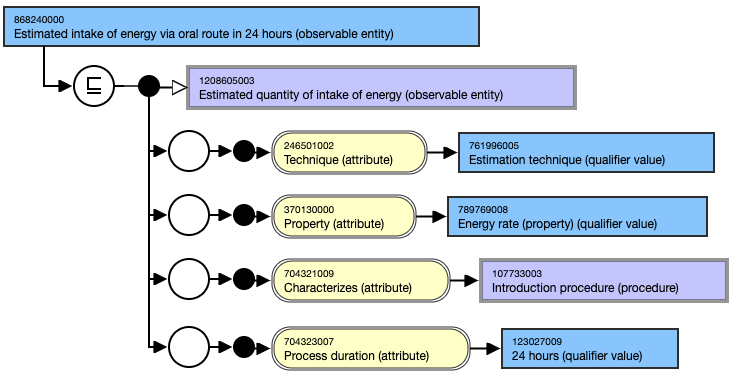
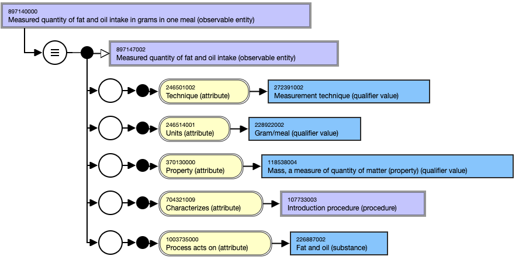
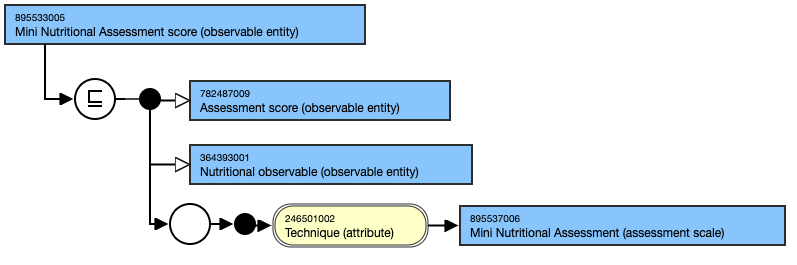
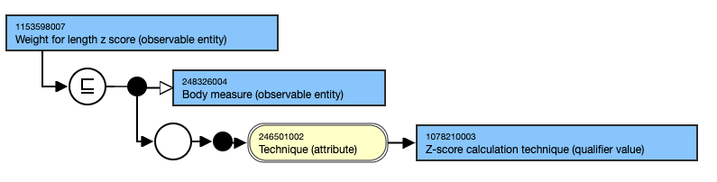

# 4.1 Nutrition Assessment and Reassessment

# Content and Modeling

  * **Main hierarchies**
    * Terminology for **nutrition assessment** is predominantly from the **Observable Entities** hierarchy and includes questions relating to client and food/nutrition-related history, anthropometric measurements, biomedical tests and assessment tools. Also included in nutrition assessment is nutrition focused physical findings from the Clinical Finding hierarchy. Nutrition Monitoring and Evaluation concepts are not yet included in the SNOMED CT NCPT reference set. 
  * **Key attributes and value ranges**
    * A range of attributes are available to represent the properties for concepts in this hierarchy ([Observable Entity Defining Attributes](https://confluence.ihtsdotools.org/display/DOCEG/Observable+Entity+Defining+Attributes)); however, the key attributes that are used for content in the scope of nutrition assessment and reassessment include:
      * **Technique:** This attribute links to a concept from the Technique (qualifier value) hierarchy and specifies the observation method, e.g., estimation, measurement.
      * **Property:** This attribute links to a concept from the Property (qualifier value) hierarchy and specifies the type of feature to be observed, e.g., intake quantity, energy intake.
      * **Characterizes:** This attribute links to a concept from the Introduction procedure (procedure) hierarchy and specifies the process associated with intake quantity or energy intake, e.g. administration via gastrointestinal route.
      * _Please view the examples below illustrating the modeling of these concepts._
  * **Templates**
    * As part of the content development process, authoring templates were created to support future content additions and quality assurance of existing and new content in this area._[Nutritional intake (observable entity) - v3.0](https://confluence.ihtsdotools.org/display/SCTEMPLATES/Nutritional+intake+%28observable+entity%29+-+v3.0)_

This template ensures that nutrition assessment concepts are modeled clearly, consistently, and clinically relevant, supporting effective documentation and interoperability in healthcare settings.

# Examples

## Food/nutrition related history

###  868240000 |Estimated intake of energy via oral route in 24 hours (observable entity)|

<figure></figure>

### 897140000 |Measured quantity of fat and oil intake in grams in one meal (observable entity)|

<figure></figure>

  

## Assessment, monitoring and evaluation tools

### 895533005 |Mini Nutritional Assessment score (observable entity)|

<figure></figure>

###  1153598007 |Weight for length z score (observable entity)|

<figure></figure>

  

  

  

  

