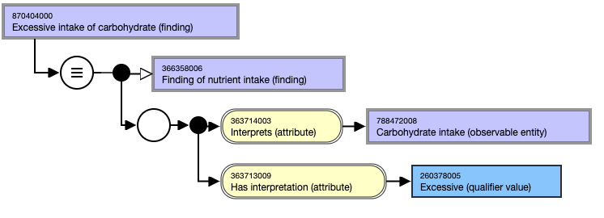
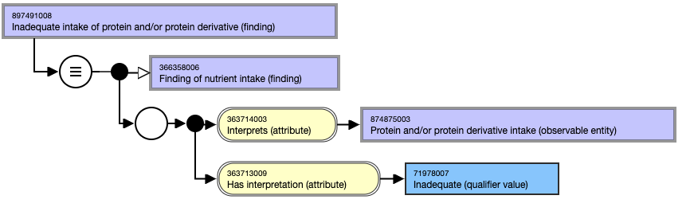
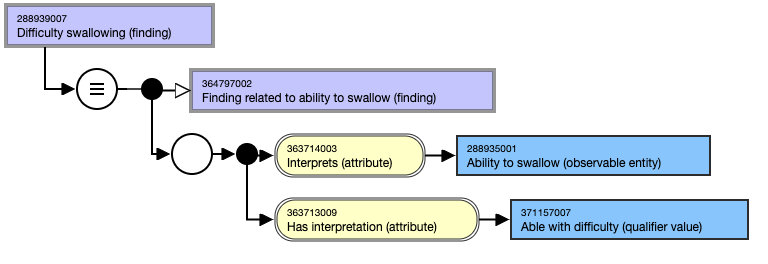
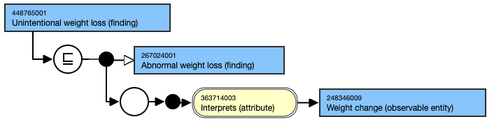
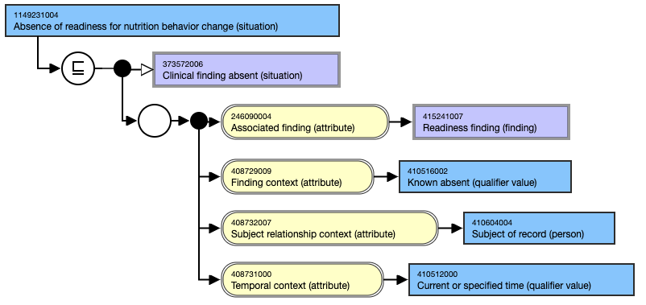
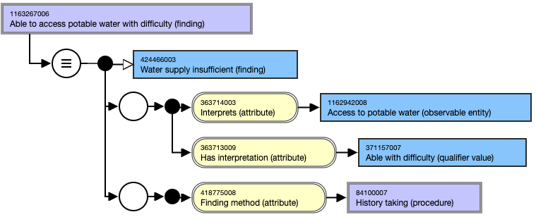

# 4.2 Nutrition Diagnosis

# Content and Modeling

  * **Main hierar chies**
    * Terminology for **nutrition diagnosis** is predominantly but not exclusively from the **Clini cal Finding** hierarchy within SNOMED CT. This hierarchy includes concepts related to nutrition-related health issues, conditions, and diagnoses, such as malnutrition, nutrient deficiencies and imbalances.

  * **Key Attributes and Value Ranges**
    * A range of attributes is available to represent the properties for concepts within this hierarchy ([Clinical Finding Defining Attributes](https://confluence.ihtsdotools.org/display/EDUEG/Clinical+Finding+Defining+Attributes)); however, the key attributes relevant for nutrition assessment and diagnosis include:
      * **Interprets** : This attribute links the diagnosis to an observable entity being assessed or measured. For example, a diagnosis of '**difficulty swallowing** ' interprets the observation related to a patient's 'ability to swallow', see the example below. This attribute specifies what aspect of nutrition or health is being interpreted within the context of the diagnosis.
      * **Has Interpretation** : This attribute represents the outcome or evaluation of the observation, specifying how the observation is interpreted in relation to the diagnosis. For example, it may link to a **Qualifier Value** such as **Deficient** , **Excessive** , or **Normal** intake, providing a clear description of the interpretation relevant to the nutrition diagnosis.
      * These attributes, **Interprets** and **Has Interpretation** , ensure that each diagnosis is directly linked to the observed data and its interpretation, allowing for precise and standardized representation of nutrition-related diagnoses within SNOMED CT.

  * **Templates**
    * As part of the content development process, authoring templates were created to support future content additions and quality assurance of existing and new content in this area. [Nutrition intake (finding) - v1.0](https://confluence.ihtsdotools.org/display/SCTEMPLATES/Nutrition+intake+%28finding%29+-+v1.0)

This template ensures that nutrition diagnosis concepts are modeled in a clear, consistent, and clinically relevant manner, supporting effective documentation and interoperability in healthcare settings.

# Examples

## **Nutrition Intake findings**

Problems related to intake of energy, nutrients, fluids, bioactive constituents through oral diet or nutrition support.

#### 870404000 |Excessive intake of carbohydrate (finding)|

<figure></figure>

#### 897491008 |Inadequate intake of protein and/or protein derivative (finding)|

  

<figure></figure>

  

### Clinical Nutrition Diagnoses 

Nutritional findings/problems identified that relate to medical or physical conditions

#### 288939007 |Difficulty swallowing (finding)|

<figure></figure>

#### 448765001 |Unintentional weight loss (finding)|

<figure></figure>

### Behavioral-Environmental Nutrition Diagnoses 

Nutritional findings/problems that relate to knowledge, attitudes, beliefs, physical environment, access to food or food safety

#### 1149231004 |Absence of readiness for nutrition behavior change (situation)|

<figure></figure>

  

#### 1163267006 |Able to access potable water with difficulty (finding)|

<figure></figure>
