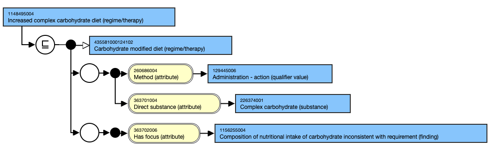
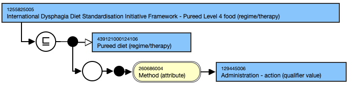
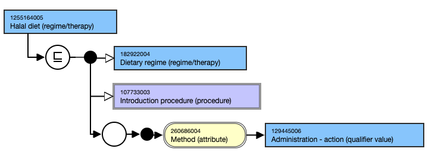
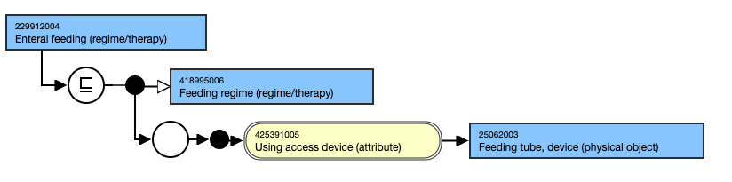
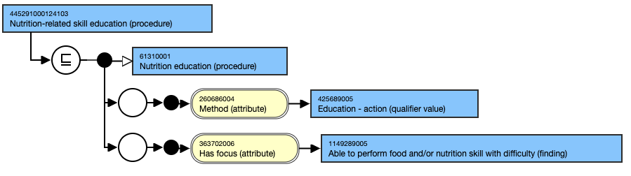
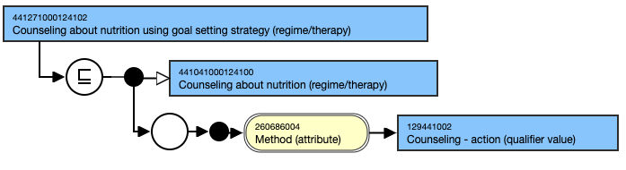

# Nutrition Interventions

## Content and Modeling

* **Main hierarchies**
  * Terminology for nutrition interventions are represented in the SNOMED CT [386373004 | Nutrition therapy (regime/therapy)|](http://snomed.info/id/386373004) hierarchy to facilitate recording nutrition interventions such as food and/or nutrient delivery, or coordination of nutrition care by a nutrition professional. Counselling interventions are represented in SNOMED in the [441041000124100 |Counseling about nutrition (regime/therapy)|](https://browser.snomedtools.org/?perspective=full\&conceptId1=441041000124100\&edition=MAIN\&release=\&languages=en) hierarchy
    * Key branches:
      * 386373004 | Nutrition therapy (regime/therapy) |&#x20;
      * 384760004 |Feeding and dietary regime (regime/therapy)|&#x20;
      * 61310001 |Nutrition education (procedure)|.
* **Key attributes and value ranges**
  * A range of attributes are available to represent the properties for concepts in this hierarchy ([Procedure Defining Attributes](https://github.com/IHTSDO/snomed-ncpt-ig/blob/main/pages/createpage.action?spaceKey=EDUEG\&title=Procedure,+General)); however, the key attributes that are used for content in the scope of nutrition assessment and reassessment include:
    * **Method:** This attribute links to a concept from the Action (qualifier value) hierarchy and specifies the action used to perform the procedure, e.g. education, counselling, administration.
    * **Direct substance:** This attribute links to a concept from the substance hierarchy and represents the substance that is directly involved or acted upon in a clinical procedure e.g. administration of carbohydrate in 436681000124105 |Increased carbohydrate diet (regime/therapy)|.
    * **Has focus:** This attribute links to a concept from the clinical finding or procedure hierarchies, specifying the particular clinical finding or procedure that is the primary focus of the current procedure, e.g. For 437331000124101 |Increased iron diet (regime/therapy)| the focus is an inadequate intake of iron (finding)
* **Templates**
  * As part of the content development process authoring, templates were created to support future content additions and quality assurance of existing and new content in this area. Currently, there is one template outlining the model for a modified substance diet [Modified substance diet (regime/therapy) - v2.0](https://conf.spaces.snomed.org/wiki/spaces/SCTEMPLATES/pages/134000169/Modified+substance+diet+regime+therapy+-+v2.0). However, additional templates may be developed in the future to support various interventions.
  * This template ensures that nutrition diagnosis concepts are modeled in a clear, consistent, and clinically relevant manner, supporting effective documentation and interoperability in healthcare settings.

## Examples

### Food and/or Nutrient Delivery

#### 1148495004 |Increased complex carbohydrate diet (regime/therapy)|

<figure><figcaption></figcaption></figure>

#### 1255825005 |International Dysphagia Diet Standardisation Initiative Framework - Pureed Level 4 food (regime/therapy)|

<figure><figcaption></figcaption></figure>

#### 1255164005 |Halal diet (regime/therapy)|

<figure><figcaption></figcaption></figure>

#### 229912004 |Enteral feeding (regime/therapy)|

<figure><figcaption></figcaption></figure>

### Education and counselling

#### 445291000124103 |Nutrition-related skill education (procedure)|

<figure><figcaption>
**
</figcaption></figure>

#### 441271000124102 |Counseling about nutrition using goal setting strategy (regime/therapy)|

<figure><figcaption>
**
</figcaption></figure>

<a href="https://docs.google.com/forms/d/e/1FAIpQLScTmbZIf0UEQwYDkY27EEWBkaiYkHSbR0_9DmFrMLXoQLyL7Q/viewform?usp=pp_url&#x26;entry.1767247133=NCPT+IG&#x26;entry.670899847=Nutrition%20Interventions" class="button primary">Provide Feedback</a>
