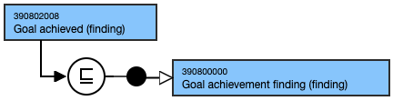

# Nutrition Monitoring and Evaluation

## Content and Modeling

* **Main hierarchies**
  * Terminology for **Nutrition Monitoring and Evaluation** is predominantly but not exclusively from the Observable Entity hierarchy, but also from the Clinical Finding hierarchy, which encompass questions, outcomes, and indicators relevant to evaluating nutrition interventions and goals.
  * The content is modeled in alignment with these previously described hierarchies
* **Templates**
  * As part of the content development process, authoring templates were created to support future content additions and quality assurance of existing and new content in this area. The templates described in the assessment and reassessment section are also applicable to monitoring and evaluation. [Nutritional intake (observable entity) - v3.0](https://conf.spaces.snomed.org/wiki/spaces/SCTEMPLATES/pages/134001915/Nutritional+intake+observable+entity+-+v3.0)&#x20;

## Examples

This will also include concepts from Nutrition Assessment and Reassessment section with some additional examples given here. With the exception of historical assessment content, Nutrition Assessment and Reassessment concepts are modified to achieve nutrition care goals and track nutrition care progress in the Nutrition Monitoring and Evaluation step of the NCP.

#### 390802008 |Goal achieved (finding)|

<figure><figcaption></figcaption></figure>

#### 870605008 |Target weight for length z-score (observable entity)|

<figure><figcaption></figcaption></figure>

<a href="https://docs.google.com/forms/d/e/1FAIpQLScTmbZIf0UEQwYDkY27EEWBkaiYkHSbR0_9DmFrMLXoQLyL7Q/viewform?usp=pp_url&#x26;entry.1767247133=NCPT+IG&#x26;entry.670899847=Nutrition%20Monitoring%20and%20Evaluation" class="button primary">Provide Feedback</a>
