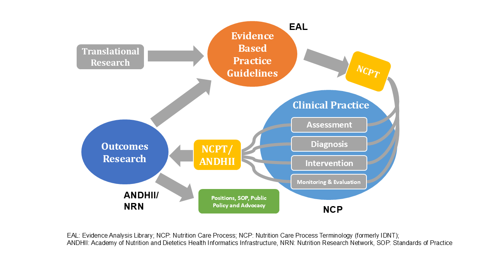

# Implementation and Flexibility in Clinical Guideline Application

### **Adapting Clinical Guidelines to Local Contexts**

Implementing the NCPT reference set and following the recommendations in this guide do not require adherence to any specific clinical guidelines. Instead, this guide is designed to support flexible application, allowing nutrition assessments, interventions, and care plans to be tailored to the diverse practices, standards, and needs found across healthcare settings. Clinical guidelines and care protocols are inherently context-dependent, and practices may vary across different organizations, regions, and countries. As such, this guide does not prescribe or recommend any particular clinical guidelines, recognizing that suitable approaches may differ based on local and organizational requirements.

### **Role of Clinical Guidelines in Supporting Optimal Care**

**Clinical guidelines** , also known as “clinical practice guidelines,” are “statements that provide recommendations intended to optimize patient care, informed by a systematic review of evidence and an evaluation of the benefits and risks of alternative care options.” Developed and implemented according to internationally recognized standards, clinical guidelines play an important role in:

* **Reducing unwarranted practice variation** by providing evidence-based recommendations
* **Facilitating the integration of research into practice** by guiding clinicians in evidence-based decision-making
* **Enhancing healthcare quality and safety** by supporting consistent standards of care

Clinical guidelines serve multiple purposes, including helping healthcare professionals deliver optimal care, establishing standards for evaluating clinical practices, and supporting patient education and informed decision-making. They can influence care outcomes positively when effectively disseminated and integrated into clinical processes.

In the delivery of nutrition and dietetics care specifically, standardized terminology facilitates the ongoing application of evidence-based practice guidelines in practice. **Aggregated structured electronic health care record data** is the backbone for tracking outcomes on various levels: at the service, the organization, the regional, national, and international levels. **Outcomes research** helps justify nutrition and dietetics position statements, related professional standards of practice, and decisions (eg funding, staffing, reimbursement or political and/or financial level decision-making depending on the country and healthcare environment). The [ANDHII](http://www.andhii.org) (The Academy of Nutrition and Dietetics Health Informatics Infrastructure) platform contains a digital NCP template that dietitians use to document nutrition care care data which is then aggregated and analyzed for outcomes tracking. **Translational research** helps validate and or further fine tune evidence-based practice guidelines. Expected care plans (ECPs) are bundles of NCPT terms that have been identified as representing the application of a specific recommendation in a guideline. Several professional and scientific organizations internationally are invested in generating timely nutrition and dietetics evidence-based practice guidelines that progress scientific clinical knowledge and care delivery.

**Completing the Evidence-Based Practice Cycle: Linking Research with Practice**

<figure><figcaption><p><em>Reprinted from J Acad Nutr Diet. 2017 May, Papoutsakis C, Moloney L, Sinley RC, Acosta A, Handu D, Steiber AL. Academy of Nutrition and Dietetics Methodology for Developing Evidence-Based Nutrition Practice Guidelines, Pages 794-804, Copyright 2017, with permission from Elsevier.</em></p></figcaption></figure>

### **Scope and Intent of Implementation Advice**

This guide supports the adoption and implementation of the NCPT reference set by providing general recommendations that can be adapted to a variety of settings. However, it does not establish specific clinical guidelines, nor does it dictate how the NCPT should be integrated within particular clinical protocols. Organizations are encouraged to interpret and apply the NCPT reference set in ways that are responsive to their unique operational contexts, existing guidelines, and local practices.

By emphasizing flexibility, this guide aims to empower healthcare organizations to utilize the NCPT reference set effectively, in alignment with their own best practices and patient care standards.

## **References**


```
1. Hickson M, Papoutsakis C, Madden AM, Smith MA, Whelan K. Nature of the evidence base and approaches to guide nutrition interventions for individuals: a position paper from the Academy of Nutrition Sciences. Br J Nutr. May 28 2024;131(10):1754-1773. doi:10.1017/s0007114524000291

2. Kight CE, Bouche JM, Curry A, et al. Consensus Recommendations for Optimizing Electronic Health Records for Nutrition Care. Nutr Clin Pract. Feb 2020;35(1):12-23. doi:10.1002/ncp.10433

3. Lamers-Johnson E, Kelley K, Knippen KL, et al. A quasi-experimental study provides evidence that registered dietitian nutritionist care is aligned with the Academy of Nutrition and Dietetics evidence-based nutrition practice guidelines for type 1 and 2 diabetes. Front Nutr. 2022;9:969360. doi:10.3389/fnut.2022.969360

4. Lamers-Johnson E, Kelley K, Sánchez DM, et al. Academy of Nutrition and Dietetics Nutrition Research Network: Validation of a Novel Nutrition Informatics Tool to Assess Agreement Between Documented Nutrition Care and Evidence-Based Recommendations. J Acad Nutr Diet. Apr 2022;122(4):862-872. doi:10.1016/j.jand.2021.03.013

5. Long JM, Yoder A, Woodcock L, Papoutsakis C. Impact of a Registered Dietitian Nutritionist-Led Food as Medicine Program in the Food Retail Setting: A Feasibility Study. J Acad Nutr Diet. Nov 2024;124(11):1503-1513. doi:10.1016/j.jand.2024.07.007

6. Murphy WJ, Yadrick MM, Steiber AL, Mohan V, Papoutsakis C. Academy of Nutrition and Dietetics Health Informatics Infrastructure (ANDHII): A Pilot Study on the Documentation of the Nutrition Care Process and the Usability of ANDHII by Registered Dietitian Nutritionists. J Acad Nutr Diet. Oct 2018;118(10):1966-1974. doi:10.1016/j.jand.2018.03.013

7. Papoutsakis C, Moloney L, Sinley RC, Acosta A, Handu D, Steiber AL. Academy of Nutrition and Dietetics Methodology for Developing Evidence-Based Nutrition Practice Guidelines. J Acad Nutr Diet. May 2017;117(5):794-804. doi:10.1016/j.jand.2016.07.011

8. Proaño GV, Papoutsakis C, Lamers-Johnson E, et al. Evaluating the Implementation of Evidence-based Kidney Nutrition Practice Guidelines: The AUGmeNt Study Protocol. J Ren Nutr. Sep 2022;32(5):613-625. doi:10.1053/j.jrn.2021.09.006
```


<a href="https://docs.google.com/forms/d/e/1FAIpQLScTmbZIf0UEQwYDkY27EEWBkaiYkHSbR0_9DmFrMLXoQLyL7Q/viewform?usp=pp_url&#x26;entry.1767247133=NCPT+IG&#x26;entry.670899847=Implementation%20and%20Flexibility%20in%20Clinical%20Guideline%20Application" class="button primary">Provide Feedback</a>
