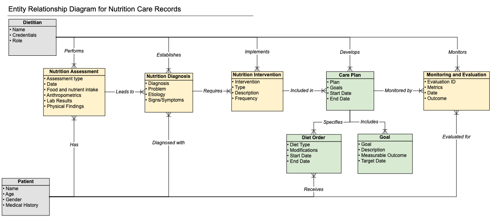

# Logical Model

## HL7 Domain Analysis Model for Nutrition Care

The _HL7 Domain Analysis Model: Nutrition Care, Release 3 Standard_([December 2022-2024)](https://www.hl7.org/implement/standards/product_brief.cfm?product_id=609) outlines a comprehensive framework for implementing and standardizing nutrition care processes in healthcare environments. Developed by Health Level Seven International (HL7) in collaboration with the Academy of Nutrition and Dietetics, this document focuses on enhancing the integration and interoperability of nutrition-related data within Electronic Health Records (EHRs) and other health information systems.

The model builds on the Nutrition Care Process (NCP), which standardizes the steps of Nutrition Assessment, Diagnosis, Intervention, and Monitoring/Evaluation to ensure consistent and high-quality nutrition care. This framework emphasizes patient-centered care, quality improvement, and the effective communication of nutrition orders and assessments across multidisciplinary healthcare teams.

The _HL7 Domain Analysis Model_ elaborates on the specific workflows and data elements necessary for effective documentation, providing practical use cases such as diet ordering, food allergy management, and tailored nutrition interventions.

## Logical Model for Nutrition Care Records

This page adapts the _HL7 Domain Analysis Model for Nutrition Care,_ and provides a Logical Model for the Nutrition Care Process (NCP), which serves as a **technology-agnostic common reference** , designed to be **adaptable to specific implementation requirements** while highlighting where terminology bindings to SNOMED CT can be applied. By outlining essential entities, such as **Patient** , **Dietitian** , **Assessment** , **Diagnosis** , **Intervention** , and **Monitoring/Evaluation** , and their relationships, this model aims to support consistent and organized documentation across the entire care process, provided it is implemented correctly.

### Key Entities

The **Nutrition Care Records Model** outlines a comprehensive framework for managing nutrition care, highlighting key entities' roles and interactions to support patient-centered outcomes.

* **Patient** is the central entity, representing the individual who receives nutrition care. The patient is linked to various elements of the care process, including nutrition assessments, diet orders, and monitoring and evaluation activities.
* **Dietitian** plays a pivotal role throughout the care process. Dietitians perform nutrition assessments, establish nutrition diagnoses, implement appropriate interventions, develop care plans, and monitor the patient’s progress. They ensure that the nutrition care provided aligns with evidence-based practices and patient-specific needs.
* **Nutrition Assessment** involves collecting and analyzing data, such as anthropometric measurements, food and nutrient intake, lab results, and physical findings. This assessment informs the **Nutrition Diagnosis** , where dietitians identify nutrition-related problems. Each assessment may lead to one or more diagnoses, guiding the interventions needed.
* **Nutrition Diagnosis** identifies specific nutrition issues, using information gathered from the assessment. Each diagnosis may require multiple **Nutrition Interventions** , which are specific actions taken to address the identified problems, such as dietary adjustments, nutritional counseling, or supplementation.
* **Nutrition Intervention** represents the implementation of strategies designed to improve the patient’s nutritional status. These interventions are included in a broader **Care Plan** , which outlines the goals, strategies, and timeline for the patient’s nutrition care.
* **Care Plan** is a comprehensive blueprint for managing the patient’s nutrition. It specifies measurable **Goals** that outline desired outcomes, such as weight management or improved nutrient intake. The care plan also details **Diet Orders** , which provide instructions on the types and modifications of diets to be provided to the patient.
* **Diet Order** outlines specific dietary requirements for the patient, such as a low-sodium or high-protein diet, based on the nutrition interventions outlined in the care plan. These diet orders ensure that nutrition therapy is tailored to the patient’s needs.
* **Monitoring & Evaluation** tracks the effectiveness of the care plan by assessing whether the set goals are being met. The dietitian monitors the patient’s progress, using metrics and outcomes to adjust the care plan as needed. This ongoing evaluation ensures that nutrition care remains effective and responsive to the patient’s health status.

### Diagram

The provided ER (Entity-Relationship) diagram for Nutrition Care Records illustrates the relationships between key entities involved in nutrition care and how they interact at the data storage level. It is important to note that this diagram does **not** represent a clinical workflow. Instead, it demonstrates how data collected during a clinical workflow can be structured and associated within a database. This model has been developed as part of this guide to highlight the key entities relevant to nutrition care and to indicate where the SNOMED CT NCPT reference set can be utilized.

<figure><figcaption></figcaption></figure>

