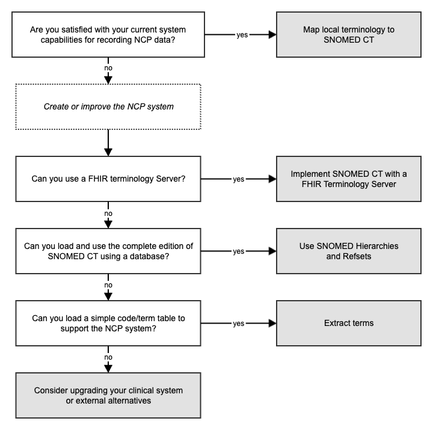

# 6.1 Implementation Approaches and Considerations

Implementing the SNOMED CT Nutrition Care Process Terminology (NCPT) Reference Set (Refset) within a clinical system can significantly improve the quality, consistency, and interoperability of nutrition documentation. This page outlines general approaches and considerations for successfully integrating the NCPT Refset into clinical workflows. These approaches will support healthcare professionals, technical implementers, and informatics teams in aligning documentation with the Nutrition Care Process (NCP) model.

# Key Approaches for Implementing the NCPT Reference Set

The flowchart below illustrates key considerations and decisions involved in selecting the optimal approach for implementing the NCPT. Detailed descriptions of each approach are provided below.

<figure></figure>

## Mapping

Mapping the NCPT Refset to existing local terminology is a common and practical starting point for implementation. By aligning SNOMED CT concepts within the NCPT Refset to equivalent or related terms used in the clinical system, mapping allows for accurate representation of nutrition-specific concepts without requiring extensive changes to existing systems.

### Recommendation

Collaborate with clinical experts to ensure mappings accurately reflect the intended meanings within the nutrition and dietetics domain. SNOMED International offers a free online mapping service, [Snap2SNOMED](https://www.implementation.snomed.org/mapping-tools), which can be used to efficiently map local codes to SNOMED CT.

## Extracting a Plain List of Refset Members for Specific Contexts

In certain contexts, such as documenting diagnoses, interventions, or outcomes, it may be beneficial to extract a plain list of relevant NCPT Refset members. This approach enables easy access to the specific concepts needed for different stages of the Nutrition Care Process without overloading the system with unrelated terms.

### Recommendation

For each concept, extract its unique identifier, terms, and domain (e.g., diagnosis, intervention, monitoring) to create a streamlined list that aligns with your specific implementation needs. The [SNOMED Term Extractor](https://github.com/IHTSDO/snomed-term-extractor) is a useful tool for this task, allowing efficient extraction of relevant SNOMED CT concepts directly from the terminology hierarchy. Use the bindings specified in General Terminology Bindings to determine the relevant SNOMED CT areas and subhierarchies for each data element, ensuring precise alignment with the appropriate SNOMED CT concepts. For this approach, it is important that you utilize the latest version of SNOMED CT and the NCPT reference set, as described in [6.3 Accessing the NCPT Reference Set](6.3-Accessing-the-NCPT-Reference-Set_259855708.html).

## Utilizing Hierarchies

SNOMED CT is organized hierarchically, allowing for flexible navigation from broad categories (e.g., body systems or clinical findings) down to specific details (e.g., particular conditions or interventions). Implementers can utilize these hierarchies to contextualize NCPT concepts, enhance search functionality, and streamline data entry by directing clinicians to the most appropriate concept level.

### Recommendation

Refer to the bindings specified in [5.3 General Terminology Bindings](5.3-General-Terminology-Bindings_259855745.html) to identify the relevant SNOMED CT areas and subhierarchies for each data element. These bindings will help ensure accurate alignment with the appropriate SNOMED CT concepts. For this approach, it is important that you utilize the latest version of SNOMED CT and the NCPT reference set, as described in [6.3 Accessing the NCPT Reference Set](6.3-Accessing-the-NCPT-Reference-Set_259855708.html).

## Implementing a Terminology Server

Using a terminology server can be a powerful way to manage, update, and integrate SNOMED CT concepts, including the NCPT Refset, within a clinical system. Terminology servers provide real-time access to SNOMED CT and can support dynamic updates as new versions of the terminology become available, enhancing both usability and long-term system maintenance.

Terminology servers offer centralized management of terms and facilitate seamless interoperability, especially when sharing data across systems or institutions.

### Recommendation

Engage with a technical team experienced in terminology servers and FHIR terminology services (FHIR TS) to ensure proper configuration, integration, and maintenance. Their expertise will help optimize server performance, enable seamless updates, and support interoperability across clinical applications. For this approach, it is important that you utilize the latest version of SNOMED CT and the NCPT reference set, as described in [6.3 Accessing the NCPT Reference Set](6.3-Accessing-the-NCPT-Reference-Set_259855708.html).

# Getting Started: Steps and Considerations

We recommend following these fundamental steps to ensure a successful implementation of the NCPT Refset within SNOMED CT. Begin by engaging key stakeholders and assessing system capabilities, then set clear goals and consider starting with a pilot project. Providing user training on the Refset’s purpose and benefits will further support effective integration into clinical practice.

#### Engage Relevant Stakeholders

Begin by reaching out to your SNOMED CT National Release Center (NRC) or SNOMED International representative. They can offer valuable resources and guidance on accessing and implementing the NCPT Refset, ensuring alignment with regional and global standards.

#### Review Existing System Capabilities

Evaluate your current clinical information system’s capabilities, focusing on SNOMED CT compatibility, terminology mapping tools, and integration with a terminology server. Understanding system readiness helps identify any technical adjustments needed for successful implementation.

#### Set Clear Goals for Implementation

Define specific use cases and desired outcomes for the NCPT Refset, such as improved documentation consistency, enhanced clinical decision support, or interoperability with external systems. Clear goals will help guide the project scope and implementation strategy.

#### Develop a Pilot Project

Initiate a pilot project in a focused area, such as nutritional diagnosis or intervention. Starting small allows for the testing and refinement of workflows and user interactions, providing valuable insights before scaling to a full implementation.

#### Training and Education

Conduct training for clinical users, particularly nutrition and dietetics professionals, to ensure they understand the NCPT Refset’s purpose and benefits within SNOMED CT. Providing hands-on experience builds confidence and ensures that staff are well-prepared to use the Refset effectively in their practice.

# Support and Resources

For additional guidance, technical resources, or support with the NCPT Refset implementation, consider reaching out to:

  * **National Release Center (NRC):** snomed.org/members
  * **Nutrition and Dietetics Clinical Reference Group (CRG):** Participate in discussions or obtain updates related to NCPT within SNOMED CT by joining the Nutrition and Dietetics CRG. [Nutrition and Dietetics Clinical Reference Group](https://confluence.ihtsdotools.org/display/NDCRG/Nutrition+and+Dietetics+Clinical+Reference+Group)
  * **SNOMED International Implementation Support Team:** [implementation@snomed.org](mailto:implementation@snomed.org)

