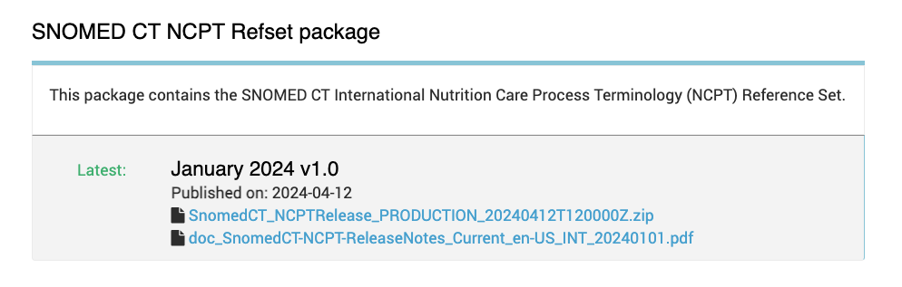

# Accessing the NCPT Reference Set

The NCPT reference set is distributed as an independent derivative package. Using it requires a valid Affiliate License, which can be obtained through national or international channels depending on the user’s location. Understanding the licensing requirements and processes is essential for proper utilization and compliance. For more detailed information on obtaining a license and accessing the NCPT reference set, users should contact their National Release Center or SNOMED International directly.

## License to Use SNOMED CT

To access and use the NCPT reference set, users must have a valid Affiliate License for SNOMED CT. SNOMED CT is a globally recognized clinical terminology standard, and its usage is governed by strict licensing agreements to ensure compliance and proper utilization. Licensing ensures that users are authorized to access and implement SNOMED CT in their systems.

Individuals or organizations interested in using SNOMED CT must obtain an Affiliate License through their respective National Release Center (NRC) or via SNOMED International.

More information can be found here: [https://www.snomed.org/get-snomed](https://www.snomed.org/get-snomed)

Countries that are members of SNOMED International have specific licensing arrangements in place for accessing SNOMED CT, including the NCPT reference set.

The following points outline the key aspects of member licensing:

* **Member Countries:** Member countries have a national licensing arrangement with SNOMED International. Healthcare professionals and organizations within these countries can usually access SNOMED CT through their NRC without additional licensing fees.
* **Access via NRCs:** National Release Centers are responsible for distributing SNOMED CT within their respective countries. They provide access, support, and updates to licensed users. Users should contact their NRC for specific details on how to access the NCPT reference set.
* **Non-Member Countries:** In countries that are not members of SNOMED International, individuals and organizations must directly approach SNOMED International to obtain the necessary licenses. This may involve additional costs and compliance with international licensing requirements.

## Accessing the NCPT Reference Set via MLDS

The SNOMED International Member Licensing and Distribution Service (MLDS) facilitates access to the NCPT reference set by providing a centralized platform for distributing SNOMED CT and its related reference sets.

The MLDS simplifies the distribution and licensing process for SNOMED CT, including the NCPT reference set. It is available to users through their National Release Centers (NRCs) in member countries and directly through SNOMED International for users in non-member countries.

### Access to MLDS

* **MLDS:** [**snomed.org/mlds**](https://mlds.ihtsdotools.org/)
* **User Guidance:** [**MLDS User Guide**](https://app.gitbook.com/o/h8Z6qGxuQrzM9vbx5bPT/s/LYgfgtQAEX6IwigniPM1/)

### Identifying the Release Package

Once logged into MLDS, you can access the NCPT release package under ‘SNOMED Releases’, as shown in the example image below. This is also the place where release notes are found.

\*\*

<figure><figcaption>
**
</figcaption></figure>
