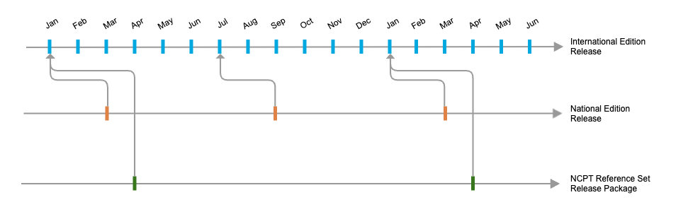

# Deploying the NCPT Reference Set

## Introduction

Effective use of the content of the Reference Set requires access to the content in ways that leverage the features of the terminology. A terminology service is a software function that interfaces with and provides access to information from one or more representations of a terminology.

Different technical options are available for implementing terminology services, such as using a relational database, other database options (such as Graph databases ), or predefined services accessible via an API (for example, SNOMED International's Snowstorm).

When deploying the NCPT reference set, it is important to decide on an appropriate approach. The choice will depend on factors such as the organization’s existing infrastructure, the complexity of integration, and the level of flexibility required. Whether opting for a local database solution or a cloud-based service, the decision should ensure efficient retrieval, updates, and management of the terminology content.

Regardless of the technological platform chosen to deploy the Reference Set content, the process always involves importing a SNOMED CT Edition and the reference set in the server or database.

## Required Release Packages

To load the NCPT reference set, the RF2 packages required are:

* The latest version of the national release you have access to
  * For national extension packages, the corresponding international edition is also required (the version that the national extension is dependent on)
* The latest version of the NCPT Release Package where the International Edition dependency is not newer than the version you are using.
  * The release notes accompanying the NCPT release package include a chapter titled ‘Versions,’ which details the International Edition dependency of the current release package.

## Understanding Releases and Dependencies

The NCPT (Nutrition Care Process Terminology) Reference Set is aligned with specific releases of the SNOMED CT International Edition. Each version of the NCPT Reference Set is released annually in April and is dependent on the January release of the International Edition.

For users in a specific country or region, access to the descriptions of the reference set members, including translations, requires the use of the National Edition. The national extension may incorporate localized descriptions for the concepts referenced in the reference set, ensuring translations are available for use in the target language. Without the national extension, users will only have access to the descriptions provided in the International Edition.

National Editions follow independent release cycles, which vary by country or member organization. Some National Editions are released monthly, others quarterly, and some biannually. SNOMED CT is designed to accommodate these variations in release schedules, with comprehensive history tracking to manage any discrepancies that arise due to differing update cycles.

**Example Scenario**

A National Edition is released in September and is based on the July release of the International Edition.

At the same time, the NCPT Reference Set, dependent on the January International Edition, is required by implementations in this Member country.

In this case, certain concepts within the International Edition that are referenced in the NCPT Reference Set may have been inactivated between the January and July releases.

When the September National Edition is implemented alongside the April version of the NCPT Reference Set, this could result in references to inactive concepts.

<figure><figcaption></figcaption></figure>

To address this, SNOMED CT’s design enables easy identification and resolution of any references to inactive concepts when updating to the new National Edition.

This process ensures that the NCPT Reference Set remains consistent and operational across varying release cycles.

## Implementation Considerations

You have two options:

1. Use the Reference set as it is, accepting the risk that some of the components may refer to inactive concepts

* **Benefit** : No need to spend time and resources on processing or updating the reference set before implementation. This approach allows for quicker deployment, reducing the upfront effort required. Additionally, SNOMED CT provides tools and workarounds, such as historical associations, to mitigate the impact of using inactive content.
* **Challenge** : Risk of coding with concepts that are inactive in the current version of SNOMED CT


This approach is commonly adopted by most implementations because it offers easy deployment, and SNOMED CT provides workarounds for using inactive content, such as historical associations. The key recommendation is to consistently apply the latest version of the published reference set. This ensures that the reference set’s content remains aligned with a more recent version of the International Edition, preventing it from becoming outdated.


2. Conduct a pre-implementation processing step to resolve any references to inactive concepts

* **Benefit** : The reference set will be fully aligned with the version of SNOMED CT applied in the implementation
* **Challenge** : Various requirements needs to be in place, including
  * Expertise knowledge on SNOMED CT
  * Services supporting the identification of proposed replacements (see section below)
  * Services to publish the updated reference set

### Managing References to Inactive Concepts

Inactive concepts within the NCPT Reference Set do not present an obstacle for normal use. SNOMED CT provides tools to identify and manage these inactive concepts through Expression Constraint Language (ECL) queries.

To locate references to inactive concepts within the NCPT Reference Set, you can use the following ECL:


```
^ 1303957004 |NCPT (Nutrition Care Process Terminology) reference set| {{C active=0}}
```


This ECL query identifies all concepts within the NCPT Reference Set that are currently inactive (\`active = false\`). This is useful when you need to review or manage concepts that are no longer active.

If you prefer to work only with active concepts and exclude any that have been inactivated, you can use the inverse ECL:

<pre data-overflow="wrap"><code><strong>^ 1303957004 |NCPT (Nutrition Care Process Terminology) reference set| {{C active=1}}
</strong></code></pre>

This query returns only those concepts within the NCPT Reference Set that are currently active (\`active = true\`). It ensures that you are working with concepts that are up-to-date and valid according to the latest standards.

Additionally, if you need to combine this selection with a hierarchy selection, such as selecting only those concepts within a specific clinical hierarchy, you can do so while ensuring all results are active.

For example, if you are only interested in active concepts within the "Clinical finding" hierarchy, the ECL would be:


```
^ 1303957004 |NCPT (Nutrition Care Process Terminology) AND << 404684003 |Clinical finding (finding)|
```


This combined ECL query retrieves all active concepts in the NCPT Reference Set that fall within the "Clinical finding" hierarchy, ensuring that your results are both relevant and current.

<a href="https://docs.google.com/forms/d/e/1FAIpQLScTmbZIf0UEQwYDkY27EEWBkaiYkHSbR0_9DmFrMLXoQLyL7Q/viewform?usp=pp_url&#x26;entry.1767247133=NCPT+IG&#x26;entry.670899847=Deploying%20the%20NCPT%20Reference%20Set" class="button primary">Provide Feedback</a>
